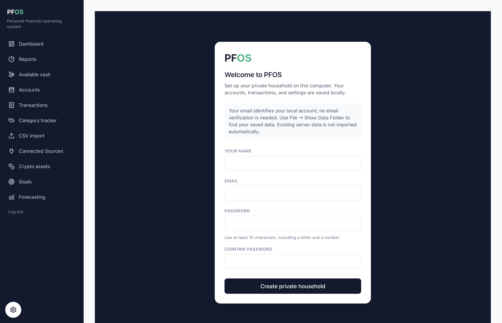
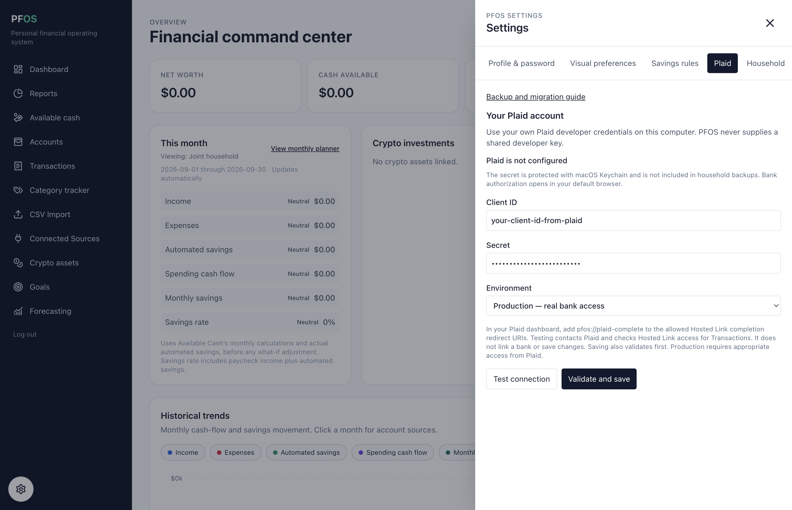

# Personal Financial Operating System (PFOS)

A private, self-hosted financial operating system for one household. It is intentionally not multi-tenant SaaS: each deployment is isolated, low-cost, and controlled by the household.

## First run in the desktop app (v0.1.6)

1. Install and open PFOS. The current macOS build is described in the
   [desktop installer guide](docs/DESKTOP-INSTALLER.md).
2. On **Welcome to PFOS**, enter your name, email, and a password of at least
   10 characters containing a letter and a number, then select **Create private
   household**. The email is only a local sign-in name; PFOS does not send a
   verification email. Existing server data is not imported automatically.
3. PFOS opens the dashboard. You can begin with manual accounts or CSV imports,
   or complete the optional Plaid setup below to connect U.S. financial
   institutions.
4. Before adding real data, use **File → Back Up Local Data…** and keep the
   backup somewhere separate from the computer. See the
   [desktop backup guide](docs/DESKTOP-BACKUPS.md).



The screenshot was captured from v0.1.6 with an empty, isolated local profile.

## Set up Plaid in the desktop app

Plaid is optional. Every PFOS installation uses the household's own Plaid
developer account; PFOS does not include or share Plaid credentials. Start in
Sandbox, then switch to Production only after Plaid grants real-data access.

### 1. Create a Plaid developer account and get Sandbox keys

1. [Create a Plaid Dashboard account](https://dashboard.plaid.com/signup) and
   verify the email address. Plaid calls the account and its members a *team*.
2. Open **Developers → API Keys**, or go directly to
   [Plaid API Keys](https://dashboard.plaid.com/developers/keys).
3. Copy the **client ID** and reveal/copy the **Sandbox secret**. The client ID
   identifies the team. Sandbox and Production have different secrets, so the
   secret must match the environment selected in PFOS.
4. Complete Plaid's
   [application profile](https://dashboard.plaid.com/settings/company/app-branding)
   and [company profile](https://dashboard.plaid.com/settings/company/profile).
   Some Production institutions will not appear until these profiles are
   complete.

Treat the client ID and especially the secret like passwords. Do not put them in
an issue, screenshot, commit, `.env` file in Git, or household backup. Bank
usernames and passwords are entered only into Plaid Link in the system browser,
never into PFOS settings.

### 2. Allow PFOS to return from Plaid Link

In the Plaid Dashboard, open **Developers → API** and add this exact value under
**Allowed Hosted Link completion redirect URIs**:

```text
pfos://plaid-complete
```

This is a desktop-app URI, not a website, and it should not have a trailing
slash. Plaid's [Hosted Link documentation](https://plaid.com/docs/link/hosted-link/)
confirms that a custom-scheme completion URI must be allowlisted in the
Dashboard. Receiving this URI only brings PFOS back to the foreground; PFOS
still asks Plaid directly whether the Link session succeeded.

### 3. Verify the integration in Sandbox

1. In PFOS, select the gear at the lower left, then **Plaid**.
2. Paste the client ID and Sandbox secret and select **Sandbox — test data**.
3. Select **Test connection**. A successful test checks that Plaid can create a
   Hosted Link session for the Transactions product; it does not save the keys
   or link a bank.
4. Select **Validate and save**. PFOS validates again and protects the secret
   with macOS Keychain. The secret field clears after it is saved.
5. Open **Connected Sources → Connect a bank with Plaid**. For a live Sandbox
   OAuth test, select **Platypus OAuth Bank** and complete Plaid's sample flow.



The values shown above are synthetic examples, not working credentials. The
complete desktop credential lifecycle and browser handoff are documented in
[Per-installation Plaid setup](docs/DESKTOP-PLAID.md).

### 4. Get free Production access for up to 10 Items

Plaid's current free real-data plan is named **Trial**. For eligible new Plaid
teams in the United States or Canada, it includes the Transactions product and
allows up to **10 Production Items**. PFOS v0.1.6 currently requests U.S.
institutions.

An Item is not one checking, savings, or credit account. It is one login at one
financial institution, and one Item can contain several accounts available
through that login. The 10-Item limit is cumulative: removing an Item does not
restore its slot. If you reach 10, Plaid requires an upgrade to a paid plan to
link another Item. Plaid documents the distinction in its
[Item glossary](https://plaid.com/docs/quickstart/glossary/) and
[Trial plan limits](https://plaid.com/docs/account/billing/#trial-plans).

To request the Trial plan:

1. Sign in to the Plaid Dashboard and select the Trial-plan button on the home
   page, or open the [Trial plan application](https://dashboard.plaid.com/trial-plan).
2. Complete Plaid's identity verification, accept the Master Services
   Authorization Agreement, and complete the security attestations. Submit the
   application using truthful personal/project information.
3. Most eligible applications are approved automatically. Plaid says a manual
   review normally receives an email response in 2–3 business days. After
   approval, OAuth access to most major institutions normally takes another
   6–24 hours and can take longer for some institutions.
4. Return to **Developers → API Keys** and copy the **Production secret**. The
   Production secret is different from the Sandbox secret.

Trial is available to eligible U.S./Canada developers who do not already have
Production or Limited Production access. Teams that are not eligible must use
the plan Plaid offers in their Dashboard, such as Pay-as-you-go; older teams
that already have Limited Production retain that legacy access. See Plaid's
[current Trial plan requirements](https://support.plaid.com/hc/en-us/articles/39994173227159-What-is-the-Plaid-Trial-plan)
before relying on the limit or approval timing.

### 5. Switch PFOS to real bank data

1. Return to **PFOS Settings → Plaid**.
2. Keep the same client ID, paste the Production secret, and select
   **Production — real bank access**.
3. Select **Test connection**, then **Validate and save**. Review the replacement
   warning before confirming. Sandbox Items cannot be moved to Production.
4. Open **Connected Sources → Connect a bank with Plaid**. PFOS opens Plaid's
   short-lived Hosted Link page in the default browser. Complete bank consent,
   accept the prompt to reopen PFOS, then select **Sync** beside the new source.

If the test fails, check that the selected environment matches the secret, the
Trial/Production request is approved, `pfos://plaid-complete` is in the Hosted
Link completion list, the application and company profiles are complete, and
OAuth access has had time to activate. Plaid account, approval, institution, or
billing problems must be handled through
[Plaid Support](https://dashboard.plaid.com/support/new).

## Structure

```
backend/       FastAPI, SQLAlchemy domain models, Alembic migration, seed script, tests
frontend/      Next.js App Router, TypeScript, Tailwind responsive dashboard
docker-compose.yml  PostgreSQL + API + web application
```

## Architecture and decisions

- PostgreSQL is the source of truth for server deployments; SQLite is supported for local desktop storage. All 15 requested entities use UUID keys, foreign keys, and audit timestamps (join-only `transaction_tags` is the intentional exception to audit fields).
- The API scopes every household resource through the authenticated member. Passwords are bcrypt hashes; JWTs are short-lived bearer credentials (24 hours by default).
- Imports use a stable SHA-256 fingerprint of account/date/amount/description, so re-importing a statement does not double-count transactions.
- Financial metrics are derived, not duplicated. Savings rate is monthly savings divided by monthly income; emergency target is surfaced by the dashboard alert using six months of essential monthly spend.

## Run locally

1. `cp .env.example .env`, generate unique values for every secret placeholder, and add only your own optional provider keys.
2. `docker compose up --build`
3. In another terminal run `docker compose exec api python -m app.seed` for demo data.
4. Visit http://localhost:3000 and sign in with `admin@example.com` / `change-me-now`; change the password by registering a private account for real use.

For development without Docker, install `backend/requirements.txt`, set `DATABASE_URL`, run `cd backend && alembic upgrade head`, and use `uvicorn app.main:app --reload`. Install frontend dependencies with `cd frontend && npm install && npm run dev`.

## Local desktop storage (step 1)

SQLite migration and backend compatibility are implemented. The installer is a subsequent step. See [SQLite storage and verification](docs/SQLITE.md)
for local setup, migration behavior, and the tests that exercise migrated database files.

The [Electron desktop app](docs/DESKTOP.md) bundles the interface and Python backend,
with permanent local storage, first-launch setup, and [local backup/restore](docs/DESKTOP-BACKUPS.md) (steps 2–7). Build both bundles,
then run `npm start --prefix desktop`; PFOS manages its own interface and API.
Use `npm run dev --prefix desktop` for frontend development.
An [unsigned Intel macOS installer](docs/DESKTOP-INSTALLER.md) is available in `desktop/dist/`
(step 8). Signing and notarization remain before public release.

## API surface

`/api/v1/auth` supplies registration, login and current-user endpoints. Authenticated routes cover `/household`, `/accounts`, `/categories`, `/transactions`, `/imports/preview`, `/imports/commit`, `/imports`, `/goals`, `/dashboard`, `/forecast`, and `/analysis/live-on-one-income`. The interactive OpenAPI contract is at `http://localhost:8000/docs`.

## Tests

Run backend tests with `cd backend && python -m pytest`. Use `python -m pytest --migrated-sqlite` to run existing database scenarios against migrated SQLite files with foreign-key enforcement. Tests cover authentication, financial calculations, imports, settlements, tagging, migrations, and local persistence.

## Deployment

Deploy the Compose stack to a private VPS or a home server behind HTTPS (Caddy or a managed reverse proxy). Do not expose PostgreSQL publicly. Persist the `postgres_data` volume, set a unique high-entropy JWT secret, maintain encrypted backups, and update images regularly.

## Public code, private household data

PFOS can be shared as source code without sharing a household's data. Keep `.env`, database exports, `backups/`, provider keys, and financial CSV files outside Git. Each user copies `.env.example`, generates their own secrets, and supplies their own optional Plaid, Coinbase, or Gemini credentials. See [Security and private deployment](docs/SECURITY.md) for encrypted backup and restore instructions, recovery requirements, and the public-repository checklist.

## Data integrations

PFOS normalizes CSV, Plaid, Coinbase Advanced Trade, and Gemini data into the same `accounts` and `transactions` tables. Connector credentials are Fernet-encrypted at rest using `CONNECTION_ENCRYPTION_KEY` (separate from `JWT_SECRET` in production); API responses only disclose whether credentials are configured.

- **CSV:** Upload through the CSV Import page. The file must contain `date`, `description`, and `amount` columns (case-insensitive forms are accepted). It runs through the shared normalization and deduplication path.
- **Plaid:** In the desktop app, use **Settings → Plaid** as described in the
  [first-run guide above](#set-up-plaid-in-the-desktop-app); the desktop never
  falls back to `.env` credentials. For a server deployment, set
  `PLAID_CLIENT_ID`, `PLAID_SECRET`, and `PLAID_ENVIRONMENT`. The API provides
  Link-token and public-token exchange endpoints, then synchronizes accounts
  and transactions through `/transactions/sync`.
- **Coinbase and Gemini:** Add a read-only API key and secret on the Connections page. The current adapters synchronize exchange balances; their isolated connector classes are the extension point for trade and ledger-history normalization as those account permissions are enabled.

Every remote transaction retains provider provenance (`connection_id` and `external_id`) and is deduplicated first by provider ID and then by a stable PFOS fingerprint. Sync attempts are recorded in `connection_syncs` without recording credential values or raw provider payloads.
